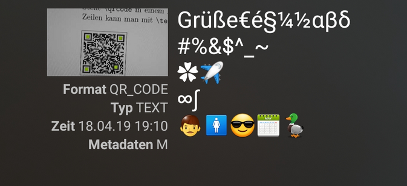

# putfenc.def

A (virtual) fontencoding to enable with pdflatex the use of non-ascii input in qrcodes. To use it, put the def where LaTeX can find it.

## Usage

See the putftest.tex (in german currently) for example of usage.

## Licence

The putfenc.def may be modified and distributed under the terms and conditions of the 
[LaTeX Project Public License](https://www.latex-project.org/lppl/), version 1.3c or greater.
 

